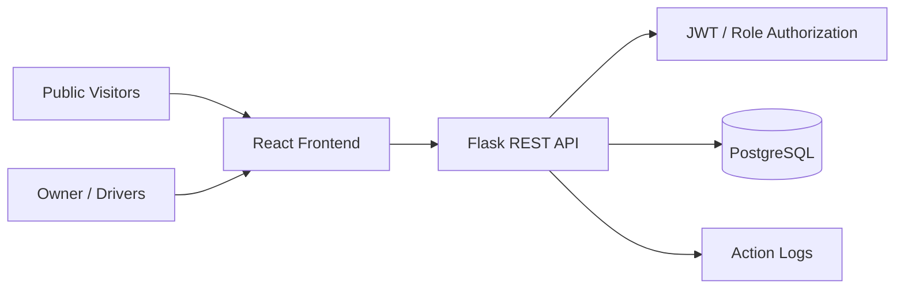

# ADF Servicios VIP

**Year:** 2026  
**Context:** Independent project for a transportation and tourism services company  
**Role:** Product definition, process modeling, system design, UX/UI, implementation direction, testing and deployment  
**Live:** [adfservicios.com](https://adfservicios.com)

## Overview

ADF Servicios VIP provides transfers, city tours and other private transportation services. The project had two goals: give the business a professional web presence and provide a management system that could be accessed from different devices by the owner and drivers.

The operational problem was largely organizational: services needed to be registered consistently, their differences had to be represented correctly, and staff needed a single chronological source of truth instead of relying on fragmented manual processes.

The resulting system centralizes the core operational entities and workflows while preserving the particularities of different transportation services.

## Main Capabilities

- Public-facing company website
- Authentication and protected management area
- Role-based access for administrative users and drivers
- Chronological service management
- Multiple service types with distinct operational fields and rules
- Drivers, vehicles, agencies and related operational entities
- Action logging and traceability
- Responsive access from desktop and mobile devices

## Architecture

The frontend is built with React and Vite, while the backend uses Flask and SQLAlchemy. The application exposes a REST API and uses JWT-based authentication with role-aware authorization for sensitive operations.

## Domain Modeling

One of the core design challenges was avoiding a generic service record that ignored how the business actually works. Different categories of transportation service can require different combinations of passenger, flight, guide, hotel, origin, destination, schedule and payment information.

The system models those operational differences while still providing a common chronological workflow for managing the business.

Examples of service categories include transfers, city tours, connections and other transportation variants.

## Authorization and Traceability

The system distinguishes administrative permissions from regular operational access. Sensitive information and management operations can be restricted based on the authenticated user's role.

Important actions are also recorded in an audit/logging layer so the business can trace changes and identify which user performed an operation.

## Database Evolution

The project originally worked with SQL Server and later moved to PostgreSQL for its cloud deployment. The migration process included schema creation, dependency-aware data transfer, sequence restoration and verification of the migrated data.

This was one of the first projects where I had to treat database evolution and deployment as operational concerns rather than only application-development concerns.

## Deployment

The frontend and backend are containerized separately. The production-oriented setup uses Docker, Nginx/Gunicorn where appropriate, and Google Cloud infrastructure. The public deployment is available at [adfservicios.com](https://adfservicios.com).

## Technology

**Backend:** Python, Flask, SQLAlchemy  
**Frontend:** React, Vite  
**Database:** PostgreSQL; previous SQL Server deployment  
**Authentication:** JWT, role-based authorization  
**Infrastructure:** Docker, Google Cloud  
**Testing:** backend unit tests and frontend smoke tests

## What this project demonstrates

- Translating a real company's operational workflow into a software system
- Modeling domain-specific differences instead of forcing every workflow into a generic CRUD model
- Designing role-based access and administrative traceability
- Building and deploying a complete frontend/backend/database solution
- Migrating an application's persistence layer as infrastructure requirements changed
- Owning product, UX and technical decisions from problem definition through deployment
