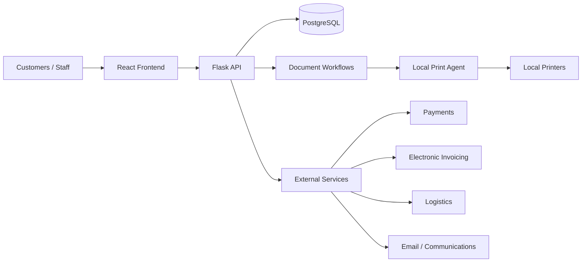
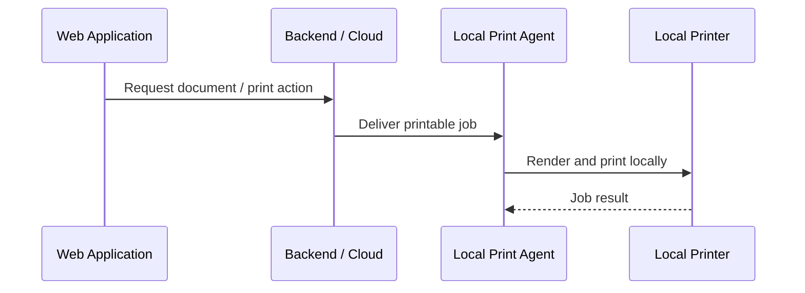

# SME Operations Platform

**Status:** In active development · 2026–Present  
**Role:** Product definition, system design, architecture, UX/UI, implementation direction, testing and deployment

## Overview

This project started from a broader problem than simply creating an online store: many small and medium-sized businesses operate through disconnected tools, manual processes and fragmented information. The platform is designed to centralize those workflows so that sales, operations, integrations and business data can be managed from a single system.

The product includes both customer-facing e-commerce capabilities and an administrative/operational layer for the business. The goal is to reduce operational fragmentation, make recurring processes easier to automate, and create a consistent information base for better business decisions.

## Main Areas

- Online and in-person sales under a shared operational model
- Product catalog, categories, pricing, inventory and stock workflows
- Purchasing and supplier-related processes
- Orders, payments and reconciliation
- Post-sales workflows and document lifecycle
- External-service integrations for payments, invoicing, logistics and communications
- Administrative auditing and operational controls
- Document generation and local printing

## Architecture

The system uses a React frontend and a Flask backend with SQLAlchemy and PostgreSQL. Database schema changes are managed through Alembic migrations, with deployment-time validation to reduce schema drift and inconsistencies between runtime code and the database.

## Selected Engineering Decisions

### Extensible integrations

Instead of treating each provider as an isolated API call, the platform evolved toward a dedicated integration layer. External systems such as payment providers, invoicing services, logistics providers and communication platforms are handled as operational integrations with their own configuration, health and lifecycle concerns.

This makes adding or replacing providers less coupled to the rest of the application and keeps integration-specific behavior away from the core business flows as much as possible.

### Cloud-to-local printing

A browser-based cloud application cannot reliably access local business printers directly. To solve that constraint, I designed a separate local printing agent that acts as a bridge between the cloud platform and printers installed at the business.

The same workflow can support different business documents such as receipts, invoices and shipping labels without requiring the web application itself to have direct hardware access.

### Shared sales model

Online and in-person sales were intentionally designed around the same underlying operational concepts instead of being treated as unrelated modules. This reduces duplication and creates a consistent foundation for inventory, orders, payments, customer records and downstream processes.

### Schema lifecycle and deployment

The project evolved from simpler schema-management approaches toward Alembic as the operational source of truth for database migrations. Pre-deployment checks validate the expected schema state and help detect inconsistencies before application revisions receive traffic.

## Quality and Operations

The repository includes automated backend tests as well as frontend smoke/E2E coverage with Playwright. Tests cover areas such as authentication, checkout, pricing, catalog behavior, integrations, document workflows, tenant resolution, reconciliation and deployment readiness.

The system also includes administrative auditability, structured operational checks and production-oriented deployment workflows.

## Technology

**Backend:** Python, Flask, SQLAlchemy  
**Frontend:** React, Vite  
**Database:** PostgreSQL, Alembic  
**Infrastructure:** Docker, Google Cloud Run  
**Testing:** Python test suite, Playwright  
**Integrations:** payments, electronic invoicing, logistics and email/communications services

## Current State

The platform is actively evolving. Some capabilities are production-ready while others continue to be refined as the product scope grows. The project is intentionally presented here as an engineering case study rather than as a claim that every planned capability is already complete.

## What this project demonstrates

- Translating business and operational problems into software workflows
- Designing a full-stack system beyond a single CRUD domain
- Integrating external systems while controlling coupling
- Reasoning about cloud/local boundaries and hardware constraints
- Evolving database and deployment practices as a system matures
- Testing, debugging and iterating on a large codebase over time
